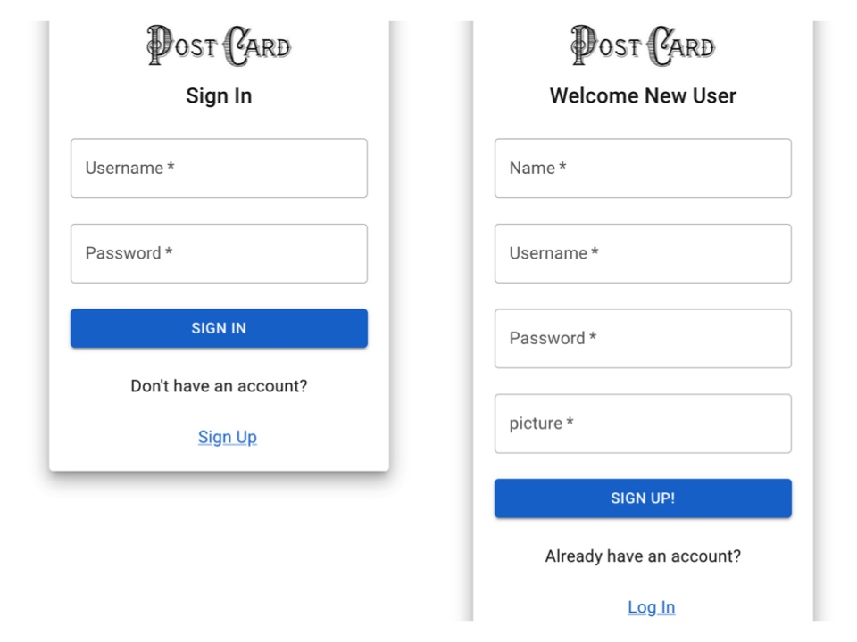
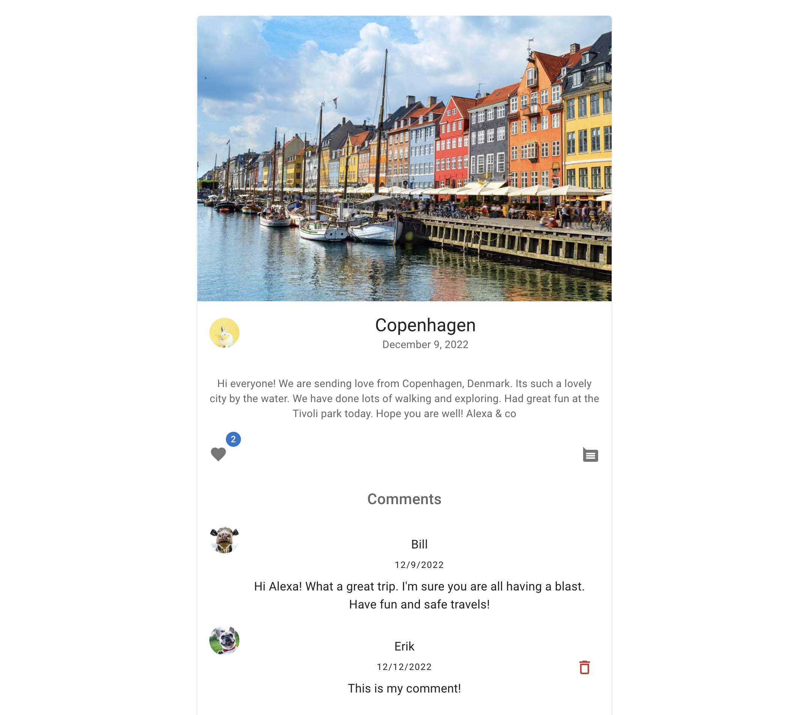

# Postcard App, a Phase 4 Project

## Summary

This project was created to demonstrate skills learned in the 4th Phase of Flatiron School's Software Development
program. This includes Rails, validations, serialization, authentication, and authorization.
The project is developed with a React frontend and a Rails API, and deployed to Render.


## Background
Thanks to modern day technology, good old snail mail is slowly becoming history. When was the last time you received a
postcard? Remember how fun it was to get one from a distant destination? Sure, we can scroll through miles of feeds on
social media to see if a friend or relative posted from their latest travels, but wouldn't it be nicer to get a
postcard? With the Postcard App you can! This is an electronic version of sending,  receiving and collecting postcards.
Easy modern day technology, sprinkled with some good old nostalgia.


## Feature Highlights

### Login and Signup


In this application users can sign up to create an account, log in with a secure password and remain logged in while
navigating the pages of the application. Authentication and authorization is implemented using session cookies and the 
CookieStore to persist user information. 


### View, create, edit and delete Postcards

Once logged in, users can view all postcards as well as create and share their own postcards. Authorization permits
the current user to edit or delete postcards they have created. 


### View, create and delete Comments

Users can view all postcard comments and create a their own comment to any postcard. Authorization permits the current 
user to delete their own comments.


## Local Development
### Requirements

- Ruby 2.7.5
- NodeJS (v16.14.0), and npm (v8.3.1)
- Postgresql
- Rails 6.1.3

### Start up
1. Fork and clone
2. `bundle install`
3. In the terminal run:
```sh
rails db:migrate db: seed
rails server
npm start --prefix client
```

## Demo
To view this project on Render click [here](https://postcard-app.onrender.com/)!

# Attribution
- [ruby](https://www.ruby-lang.org/en/)
- [rails](https://guides.rubyonrails.org/v5.0/index.html)
- [create-react-app](https://create-react-app.dev/)
- [react router](https://reactrouter.com/)
- [render](https://render.com/)
- [postgresql](https://www.postgresql.org/)
